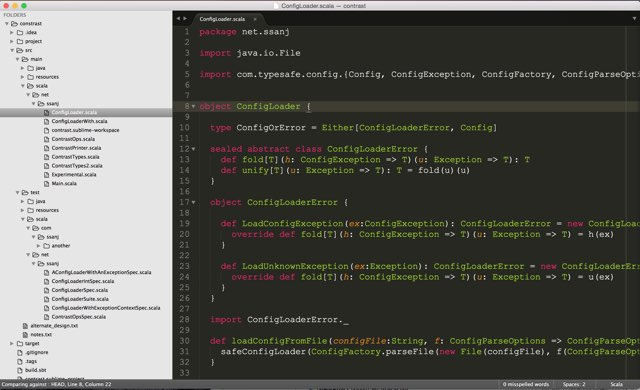
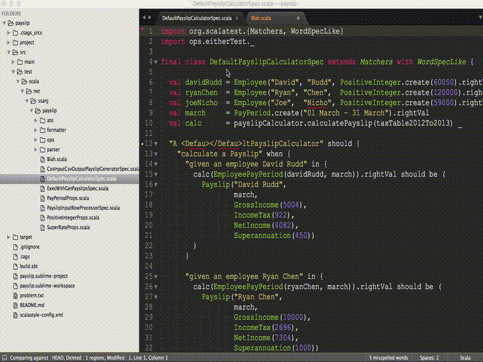
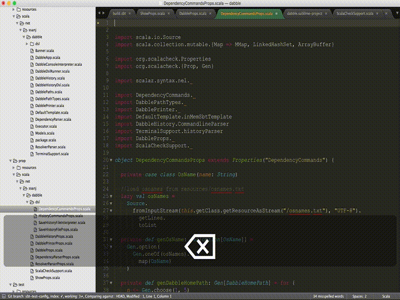

[](https://travis-ci.org/ssanj/Scoggle)

# Scoggle #

Scoggle is a Sublime Text 3 plugin that will allow you to toggle between production and test code. It will allow you to do this in a number of configurable ways.

## Installation ##

Here are a few ways to install Scoggle on your system.

1. The easiest way to install Scoggle is through [Package Control](https://packagecontrol.io).
1. Git clone the Scoggle repository into your __Packages__ directory:

    ```git clone git@github.com:ssanj/Scoggle.git```

1. [Download the latest release source code](https://github.com/ssanj/Scoggle/releases) and extract it to the __Packages__ directory.

 > The __Packages__ directory is located at:

 > * OS X: ~/Library/Application Support/Sublime Text 3/Packages
 > * Linux: ~/.config/sublime-text-3/Packages

## Configuration ##

Here is the default Scoggle.sublime-settings file:

```javascript
{
    "production_srcs" :
    [
        "/src/main/scala"
    ],
    "test_srcs" :
    [
        "/src/test/scala",
        "/src/it/scala"
    ],
    "test_suffixes" :
    [
        "Spec.scala",
        "IntSpec.scala",
        "Suite.scala",
        "Test.scala",
        "Specification.scala"
    ],
    "log" : false,
    "display_errors_in" : "dialog"
}
```

__production_src__ list the production source directories to search through when switching to a production file.
__test_srcs__ list the test source directories to search through when switching to  test file.
__test_suffixes__ list the suffixes to search for when switching to a test file.
__log__ specifies whether to turn on debug logging. __display_errors_in__ specifies where to display error messages. By default these are shown in a modal dialog ("dialog") but this can get annoying. To overcome this we have another two options: "status_bar" and "dont_display".


The plugin settings file can be overridden on a per-project basis. The configuration is as above but it has a namespace of "Scoggle" associated with it.

Here's a sample .sublime-project file with Scoggle settings:

```javascript
{
    "folders":
    [
        {
            "path": "."
        }
    ],
    "settings": {
        "Scoggle" : {
            "production_srcs" :
            [
                "/app"
            ],
            "test_srcs" :
            [
                "/test"
            ],
            "test_suffixes" :
            [
                "Spec.scala"
            ]
        }
    }
}
```

_Gotcha: remember that project settings are only active when you open the source directory as a Project not through File > Open._

_When customising settings for Windows, remember to replace forward slashes with double backslashes._

## Matching Strategies ##

Scoggle comes bundled with a three main matching strategies. You can also write your own matcher quite easily. The bundled matchers go from very specific matches to more fuzzy matches.

### Prefix Suffix ###

[__CMD + SHIFT + E__]

The production source filename is used in conjunction with the supplied __test_suffixes__ to find matching test sources.

The test source filename is used minus the largest matching __test_suffixes__ to find the matching production sources.

[](https://vimeo.com/136418521)

Example:

Given a production file named Contrast.scala in one of the __production_srcs__ paths, __test_suffixes__ of ["Spec.scala", "Suite.scala", "IntSpec.scala"] it will match the following test files in one of the __test_srcs__ paths:

* __Contrast__ _Spec.scala_
* __Contrast__ _Suite.scala_
* __Contrast__ _IntSpec.scala_

When toggling from the test source back to the production source, it does the following:

1. Removes the largest matching suffix from the test filename.
1. Searches the __production_srcs__ for a filename that matches (1)

Example:

Given a test file named ContrastIntSpec.scala in one of the __test_srcs__ paths, __test_suffixes__ of ["Spec.scala", "Suite.scala", "IntSpec.scala"] it will match the following production file in one of the __production_srcs__ paths:

* Contrast.scala (__Contrast__ ~~IntSpec~~)

_notice_ although the __Spec__ suffix would have matched the test filename, we remove the largest matching suffix. In this case that would be __IntSpec__. If we had a test file named ContrastSpec.scala we would still arrive at the same matching production file: Constrast.scala. This time we would have removed __Spec__ as the largest matching suffix.

### Prefix Wildcard Suffix ###

[__CMD + CTRL + SHIFT + E__]

The production source filename is used in conjunction a wildcard and ends with the supplied __test_suffixes__ to find matching test sources.

The test source filename is used minus the largest matching __test_suffixes__ to find a production source that matches the start of the match.

[](https://vimeo.com/136418522)

Example:

Given a production file named Contrast.scala in one of the __production_srcs__ paths, __test_suffixes__ of ["Spec.scala", "Suite.scala", "IntSpec.scala"] it will match the following test files in one of the __test_srcs__ paths:

* __Contrast__ WithinSomeContext __Spec.scala__
* __Contrast__ WithinAnotherContext __IntSpec.scala__
* __Contrast__ ThrowingAnException __Suite.scala__

When toggling from the test source back to the production source, it does the following:

1. Removes the largest matching suffix from the test filename.
1. Searches the __production_srcs__ for a filename that matches the start of (1)

Example:

Given a test file named ContrastThrowingAnExceptionSuite.scala in one of the __test_srcs__ paths, __test_suffixes__ of ["Spec.scala", "Suite.scala", "IntSpec.scala"] it will match the following production files in one of the __production_srcs__ paths:

* Contrast.scala (__Contrast__ ThrowingAnException ~~Suite~~)
* ContrastThrowing.scala (__ContrastThrowing__ AnException ~~Suite~~)
* ContrastThrowingAn.scala (__ContrastThrowingAn__ Exception ~~Suite~~)
* ContrastThrowingAnException.scala (__ContrastThrowingAnException__  ~~Suite~~)

### Wildcard Prefix Wildcard Suffix ###

[__CMD + CTRL + SHIFT + X__]

A wildcard and the production source filename is used in conjunction a wildcard and ends with the supplied __test_suffixes__ to find matching test sources.

The test source filename is used minus the largest matching __test_suffixes__ to find a production source that matches the any part of the match.

[](https://vimeo.com/136418523)

Example:

Given a production file named Contrast.scala in one of the __production_srcs__ paths, __test_suffixes__ of ["Spec.scala", "Suite.scala", "IntSpec.scala"] it will match the following test files in one of the __test_srcs__ paths:

* A __Contrast__ WithinSomeContext __Spec.scala__
* ABeautiful __Contrast__ Context __IntSpec.scala__
* Some __Contrast__ Context __Suite.scala__
* ThisCouldBeAnythingHaving __Contrast__ InItsName __Spec.scala__

When toggling from the test source back to the production source, it does the following:

1. Removes the largest matching suffix from the test filename.
1. Breaks down the remain prefix into words by capitalisation. Example: ABeautifulContrastContext is broken down into ["A", "Beautiful", "Contrast", "Context"].
1. Searches the __production_srcs__ for a filename that contains a combination of words in (2) in order from the left to right. Example: matches ABeautifulContrast and Context but not AContrastContext.

Given a test file named ABeautifulContrastContextIntSpec.scala in one of the __test_srcs__ paths, __test_suffixes__ of ["Spec.scala", "Suite.scala", "IntSpec.scala"] it will match the following production files in one of the __production_srcs__ paths:

* Contrast.scala (ABeautiful __Contrast__ Context ~~IntSpec~~)
* ABeautiful.scala (__ABeautiful__ ContrastContext ~~IntSpec~~)
* ABeautifulContrast.scala (__ABeautifulContrast__ Context ~~IntSpec~~)
* ABeautifulContrastContext.scala (__ABeautifulContrastContext__ ~~IntSpec~~)
* BeautifulContrast.scala (__BeautifulContrast__ Context ~~IntSpec~~)
* BeautifulContrastContext.scala (A __BeautifulContrastContext__ ~~IntSpec~~)
* Context.scala (ABeautifulContrast __Context__ ~~IntSpec~~)
* A.scala (__A__ BeautifulContrastContext ~~IntSpec~~)


### Writing your own Matcher ###

Before we get into how to write your matcher, lets see how the current matchers work. Matcher shortcuts are defined in .sublime-keymap files. Taking the __Prefix Suffix Matcher__ example:

```javascript
{ "keys": ["super+shift+e"], "command": "scoggle", "args": {"matcher": "prefix_suffix_matcher"}, "context" : [{"key": "selector", "operator": "equal", "operand": "source.scala", "match_all": true}]}
```

Notice how the __args__ parameter supplies a __matcher__ argument? The __matcher__ value maps to the matcher to use. The mapping is done like so:

1. Given a matcher of __prefix_suffix_matcher__, look in the __matchers__ module directory for a python file of the same name: prefix_suffix_matcher.py.
1. Load the class within that file called PrefixSuffixMatcher. Basically convert snake_case to CamelCase. Each matcher class extends scoggle_types.BaseMatcher and provides the definition for three methods:

* constructor (____init____) - that takes in a scoggle_types.MatcherParam instance.
* match_test_file - called from a production file when a matching test file needs to be found. Files are supplied from the paths specified in __test_srcs__.
* match_prod_file - called from a test file when a matching production file needs to be found. Files are supplied from the paths specified in __production_srcs__.

Both of the above methods are supplied a filename and it's associated path. The methods just have to return __True__ to include the file as match or __False__ to exclude it.

The matcher class is supplied the MatcherParam constructor parameter with the following six fields:

1. root_dir - the first matching directory in the list of production_srcs or test_srcs (Scoggle.sublime-settings) that contains the target file.
1. test_dirs - the list of test directories defined in test_srcs ((Scoggle.sublime-settings)).
1. prefix - the target file (prod or test) without an extension.
1. suffixes - the list of test suffixes defined in test_suffixes (Scoggle.sublime-settings).
1. scoggle - reference to the scoggle module.
1. logger: the logger to use for logging.

To define your own matcher:

1. Create a matcher python filed named your_matcher_name.py within the __matchers__ module (directory).
1. Within it define a YourMatcherName class that has the following attributes:
    1. Extends the scoggle_types.BaseMatcher class
    1. A constructor that takes in a MatcherParam
    1. An override of match_test_file
    1. An override of match_prod_file
1. Add keybindings to your .sublime-keymap file with a matcher argument of your_matcher_name:

```javascript
{ "keys": ["your_shortcuts"], "command": "scoggle", "args": {"matcher": "your_matcher_name"}, "context" : [{"key": "selector", "operator": "equal", "operand": "source.scala", "match_all": true}]},
```
If you want to add it to the command palette, then add an entry in the .sublime-commads file:

```javascript
{ "caption": "Scoggle: Your matcher description", "command": "scoggle", "args": {"matcher": "your_matcher_name"} }
```

If you want to add it to the context menu, then add an entry in the Context.sublime-menu file:

```javascript
{
    "id" : "scoggle",
    "caption" : "Scoggle: Your matcher description",
    "command" : "scoggle",
    "args": {"matcher": "your_matcher_name"}
}
```

To troubleshoot your matcher, turn on debug logging in your .sublime-settings or .sublime-project:

```javascript
    "log" : true
```
Open the console with (CTRL + `) to see the debug log.

In addition have a look at the existing matchers to get an idea of how everything hangs together.

## Additional Functionality ##

### Insert package ###

[__CMD + SHIFT + G__]

Inserts the package declaration at the top of a scala file. The package of the current file is derived from the production_srcs or test_srcs paths depending on which the file is on.

```scala
package your.awesome.packagename

```



### Collapse package ###

[__CMD + SHIFT + H__]

Collapses the package declaration of the current file into sub packages, when given a prefix. The packages are inserted at the top of a scala file. The package of the current file is derived from the production_srcs or test_srcs paths depending on which the file is on.

Given a package of:
```scala
your.awesome.packagename.project.feature

```

and a prefix of:

```scala
your.awesome.packagename
```

inserts:

```scala
package your.awesome.packagename
package project
package feature

```



